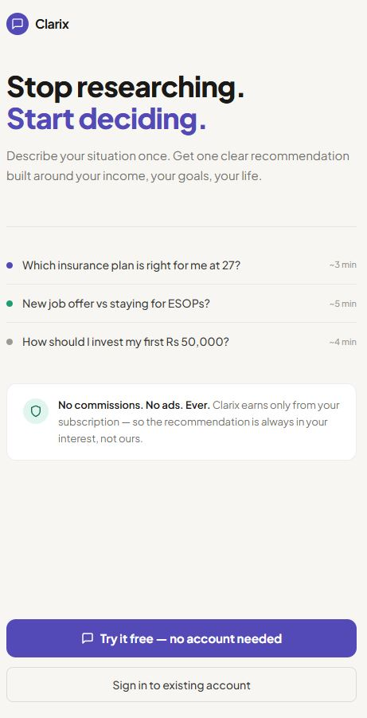
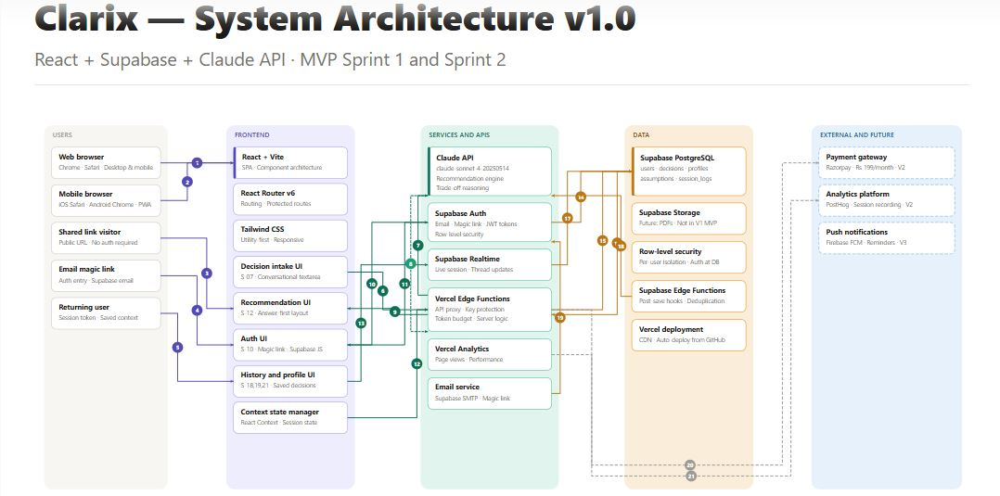
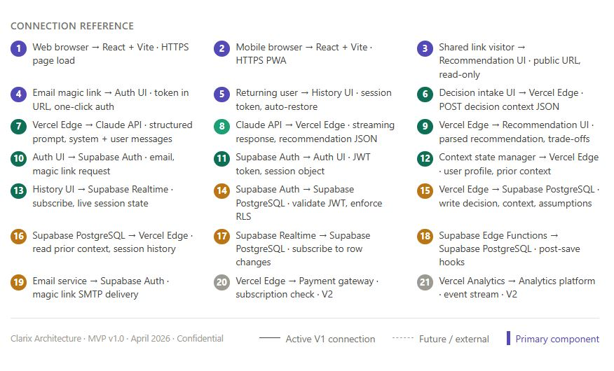

# Clarix - AI Personal Decision Assistant

> Stop researching. Start deciding.

Clarix is an AI-powered personal decision assistant that helps Indians make confident financial and career decisions without the noise of generic advice. Describe your situation in plain language and get a clear, reasoned recommendation built around your specific income, goals, and constraints — in under 15 seconds.

**Live Product:** [Link](https://clarix-ai-personal-decision-assista.vercel.app)  
**Video Walkthrough:** [Link](https://youtu.be/gLxBKVAQLFY)

---

## Landing Page



---

## System Architecture




---

## The Problem

Indians face more financial decisions than ever — insurance, investments, career switches, property purchases. The internet gives them information. Nobody gives them a decision.

- **73%** of Indian millennials delay major financial decisions due to information overload (SEBI Investor Survey 2023)
- **4.2 hours** average time spent researching before a financial decision — most of which is contradictory (BCG India Financial Literacy Report)
- **68%** of users distrust generic financial advice because it does not account for their specific situation (Kantar India 2023)

The problem is not access to information. It is the absence of a trusted, personalised voice that cuts through it.

---

## The Solution

Clarix gives users one specific recommendation built around their situation — not generic advice — with full reasoning, honest trade-offs, and the ability to challenge and refine it through conversation.

**Core user flow:**

1. User describes their situation in plain language
2. Claude API analyses 5 contextual factors — income, age, city, dependents, goals
3. One clear recommendation appears above the fold in under 15 seconds
4. User sees full reasoning, trade-offs, and assumptions on scroll
5. User corrects any wrong assumptions and gets an updated recommendation
6. User asks follow-up questions through multi-turn conversation
7. Platform integrations guide the user to act on the decision
8. User saves the decision and returns to it anytime

---

## Key Features

### Personalised AI Recommendation
Describe your situation in plain language. Get one specific recommendation with full reasoning built around your income, age, city, and goals — not generic advice.

### Assumption Correction
See exactly what assumptions Clarix made. Correct multiple assumptions at once and get an updated recommendation in a single API call.

### Follow-up Conversation
Ask what-if questions. Challenge the recommendation. Explore alternatives. Claude responds in full context of the original recommendation.

### Platform Integrations
Get directed to the right platform to act on your decision based on decision type:
- Insurance → PolicyBazaar, Ditto Insurance
- Investment → Groww, Zerodha Coin
- Career → LinkedIn, Naukri
- Housing → MagicBricks, NoBroker
- Purchase → Amazon India, Flipkart

### Guided Follow-up Questions
Four contextual questions appear below every recommendation tailored to the decision type — helping users explore their decision more deeply.

### Decision History
Save recommendations. Return to them anytime from any device. Resume a past decision and pick up where you left off.

### Defence Summary
Get a two-sentence plain language summary of your recommendation to explain it to family or friends who push back. Evaluate specific objections and get an AI response on whether they change the recommendation.

### Save and Share
Share recommendations via WhatsApp and Email. Generate a shareable link. Personal financial details are never included in shared content.

---

## Target Users

| Segment | Age | Income | Primary Decision |
|---|---|---|---|
| First Jobbers (Primary) | 22 to 28 | Rs 25,000 to Rs 60,000/month | Insurance, first investment |
| Mid-Career Switchers | 27 to 35 | Rs 60,000 to Rs 1,50,000/month | Job offers, ESOP evaluation |
| Young Families | 28 to 38 | Rs 80,000 to Rs 2,00,000/month | Term insurance, child investment |
| Near-Retirement | 55 to 65 | Pension or fixed income | FD maturity, SCSS vs savings |

---

## Tech Stack

| Layer | Technology |
|---|---|
| Frontend | React 18, Vite, Tailwind CSS |
| Routing | React Router v6 |
| AI Layer | Anthropic Claude API (claude-sonnet-4-20250514) |
| Authentication | Supabase Auth |
| Database | Supabase (PostgreSQL) |
| Deployment | Vercel |
| Version Control | GitHub |

---

## Database Schema

Six tables in Supabase PostgreSQL:

| Table | Purpose |
|---|---|
| profiles | User profile — email, plan, created date |
| context_profiles | User financial context — income range, age, city, goals |
| decisions | Saved decisions — situation, recommendation, reasoning, assumptions |
| messages | Conversation messages for follow-up threads |
| assumptions | Flagged and corrected assumptions per decision |
| session_logs | Event logging — saves, shares, corrections |
| drafts | Anonymous pre-auth drafts for save flow |

Row Level Security (RLS) is enabled on all tables. Users can only read and write their own data.

---

## Project Structure

artifacts/clarix/  
├── src/  
│   ├── screens/  
│   │   ├── public/          # Landing, shared recommendation  
│   │   ├── auth/            # Sign in, email verification, callback  
│   │   ├── decision/        # Intake, follow-up, conversation  
│   │   ├── result/          # Recommendation, save, share, defence  
│   │   ├── app/             # Home, history, past decision, context profile  
│   │   ├── account/         # Account, notifications, billing, help  
│   │   └── utility/         # Error, empty state, upgrade  
│   ├── components/  
│   │   └── layout/          # BottomNav, ProtectedRoute  
│   ├── lib/  
│   │   ├── claude.js        # Claude API integration  
│   │   ├── supabase.js      # Supabase client  
│   │   └── storage.js       # localStorage and sessionStorage helper  
│   ├── hooks/  
│   │   └── useDecision.js   # Supabase CRUD for decisions  
│   ├── context/  
│   │   └── UserContext.jsx  # Auth state management  
│   └── constants/  
│       ├── routes.js        # All route constants  
│       └── prompts.js       # Claude system prompt and user prompt builder  
├── vercel.json              # Client-side routing rewrites  
├── vite.config.ts           # Vite configuration  
└── package.json  

---

## Getting Started

### Prerequisites

- Node.js 18 or higher
- A Supabase project
- An Anthropic API key

### Installation

```bash
# Clone the repository
git clone https://github.com/yourusername/ClarixAI-PersonalDecisionAssistant.git

# Navigate to the project folder
cd ClarixAI-PersonalDecisionAssistant/artifacts/clarix

# Install dependencies
npm install
```

### Environment Variables

Create a `.env` file in `artifacts/clarix/` with these variables:  
VITE_SUPABASE_URL=your_supabase_project_url  
VITE_SUPABASE_ANON_KEY=your_supabase_anon_key  
VITE_CLAUDE_API_KEY=your_anthropic_api_key  

### Run locally

```bash
npm run dev
```

The app will be available at `http://localhost:5173`

### Build for production

```bash
npm run build
```

---

## Deployment

The project is deployed on Vercel with automatic deployments on every push to the `main` branch.

**Vercel configuration:**
- Root directory: `artifacts/clarix`
- Build command: `npm run build`
- Output directory: `dist`
- Install command: `npm install`

**Required environment variables on Vercel:**
- `VITE_SUPABASE_URL`
- `VITE_SUPABASE_ANON_KEY`
- `VITE_CLAUDE_API_KEY`

---

## Claude API Integration

Clarix uses Claude Sonnet 4 for all AI operations. The system prompt is engineered to:

- Always produce one clear recommendation — never a list of options
- Ground every recommendation in the user's specific numbers — income, age, city
- Surface honest trade-offs the user needs to know
- Make all assumptions visible and correctable
- Ask a follow-up question when critical information is missing
- Return structured JSON for consistent UI rendering

**API calls made per user session:**
- One call per recommendation (initial or after assumption correction)
- One call per follow-up conversation turn
- One call per objection evaluation on the defence screen

---

## Design System

| Token | Value | Usage |
|---|---|---|
| Brand Purple | #534AB7 | Primary actions, headings, chips |
| Brand Teal | #0F6E56 | Success states, save confirmation |
| Amber | #BA7517 | Trade-off warnings |
| Surface 0 | #FFFFFF | Card backgrounds |
| Surface 1 | #F7F6F3 | Page background |
| Ink 100 | #1A1917 | Primary text |
| Ink 50 | #6B6965 | Secondary text |
| Ink 30 | #9C9A92 | Captions and labels |

Font: Plus Jakarta Sans (Google Fonts)
Style: Minimal, calm, clinical. No gradients. No drop shadows.

---

## Product Decisions

**Why answer first?**
The recommendation is the first thing above the fold. Not a form. Not a comparison table. Users came for a decision — we give them the decision immediately and let them scroll for the reasoning.

**Why make assumptions visible?**
Most financial advice tools hide their assumptions. Clarix surfaces every assumption and gives users a Correct button. This builds trust through transparency rather than through authority.

**Why batch assumption corrections?**
Each correction previously triggered a separate Claude API call. Batching all corrections into one call reduces API costs by up to 70 percent for users who correct multiple assumptions.

**Why platform integrations?**
A recommendation without a clear next step creates a new decision problem. Platform links bridge the gap between knowing what to do and actually doing it.

**Why no commission model?**
Clarix earns only from subscriptions. No affiliate links. No referral fees. No advertising. This ensures every recommendation is genuinely in the user's interest.

---

## Pricing

| Plan | Price | Decisions |
|---|---|---|
| Free | Rs 0/month | 3 complete decisions |
| Plus | Rs 199/month | Unlimited decisions |

Payment via Razorpay — coming in V1.1.

---

## Roadmap

### V1.0 — Current
- Complete recommendation flow with assumption correction
- Multi-turn follow-up conversation
- Platform integrations for 5 decision categories
- Decision history and save flow
- Share via WhatsApp and Email
- Defence summary and objection evaluator

### V1.1 — Next
- Razorpay payment integration for Plus plan
- Context profile for faster decisions over time
- Push notifications for decision reminders
- Server-side auth callback for seamless post-verification save flow
- Shared recommendation public page

### V2.0 — Future
- Peer comparison — how similar users decided
- Decision outcome tracking — did the recommendation work?
- Vernacular support — Hindi and Tamil
- WhatsApp bot integration
- API for third-party financial platform integration

---

## Success Metrics

| Metric | Target |
|---|---|
| Decision completion rate | Greater than 65% |
| Time to first recommendation | Less than 90 seconds |
| Sign-up conversion | Greater than 25% of recommendation viewers |
| Assumption correction rate | Greater than 30% |
| D30 retention | Greater than 20% |
| Free to paid conversion | Greater than 8% within 60 days |

**North Star Metric:** Decisions saved per active user per month
**Target:** 1.5 decisions per active user per month by Month 6

---

## About

Built by **Shijin Ramesh** as a 0 to 1 product management portfolio project — covering the complete product lifecycle from market research and PRD to technical build and production deployment.

**Timeline:** April 2026
**Stack decisions:** React over Next.js for simplicity, Supabase over Firebase for SQL flexibility, Claude over GPT-4 for reasoning quality and transparent API pricing.

---

## Contact

Shijin Ramesh    
[Email ID](kshijin92@gmail.com)  
For questions, feedback, or collaboration reach out via LinkedIn or open an issue on this repository.  
[LinkedIn](https://www.linkedin.com/in/shijinramesh/) | [Portfolio](https://www.shijinramesh.co.in/)  

---

*Clarix V1.0 — No ads. No commissions. No conflicts of interest.*
